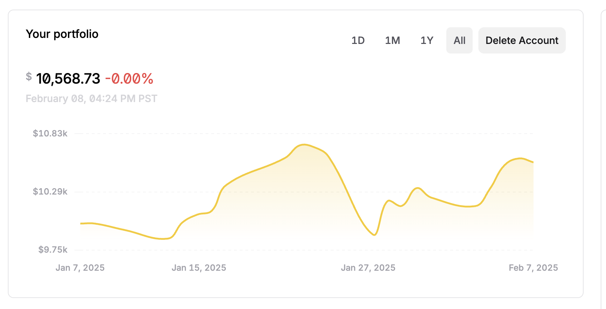

# Momentum Trading Strategy

## Overview

Simple momentum trading strategy inspired by algovibes (https://www.youtube.com/@Algovibes) and modified

## What I Added

The original strategy is from algovibes on YouTube. It's pretty simple: take the biggest gainers in the S&P 500 over
the past year and hold them for one month.

I modified this strategy because I'm impatient. I do not want to wait an entire month, so I decided to change it to holding over
just one week. Another benefit of holding for one week is that the stock is less subject to after-hours fluctuation because we do
not hold the stock over the weekend.

In the backtesting file, I've added filters to sort for stocks which have a relative strength index between 45 and 60, avoiding 
overbought or oversold conditions. Additionally, I added a check to make sure the SMA 5 is greater than the SMA 20 which confirms
bullish momentum. The run() function performs the backtest for however many weeks the user provides given a starting date.

## Project Structure

| File/Folder         | Description |
|---------------------|-------------|
| `meanhelpers/`      | Contains helper functions that calculate technical indicators: RSI, SMA |
| `stockdata/`        | Stores stock price data from S&P 500 from 2023-01-01 till now |
| `backtest_meanreversion.py`      | File to backtest the trading strategy - shows performance over n weeks |
| `downlaodstockdata.py`           | Downloads price data of the S&P 500 from yfinance |
| `trader.py`      | WIP outline for a program to place orders to alpacaapi - outline from chatgpt |

## Results

For this test, I used the original strategy with the TA filters and a SL-TP ratio. I didn't buy and sell stocks every week because I couldn't figure out how to make complex orders on alpaca api work with partial shares (and because I'm lazy) to automate buying / selling. I believe it would have performed better over the past month if it re-selected stocks every week, but I can't complain about it. Take this with a grain of salt. There were many months where this strategy broke even or lost money, and a 5% return in January is abnormal. From the backtesting, with the right numbers for a given number of weeks, this strategy is able to perform fairly well.

You can notice a significant dip on Jan 27 with the news of Deepseek lol

## Future Improvements

I have one main issue with this and a lot of other strategies, and it's that they have too high of a correlation with the S&P 500.
Though I'm no investment expert, the only reason I'm picking my own stocks is because I'm not going to accept the measly 8% return
from the S&P 500 year over year. Yet, it seems that in the long run there are far and few trading strategies that are able to outperform
the index.  
